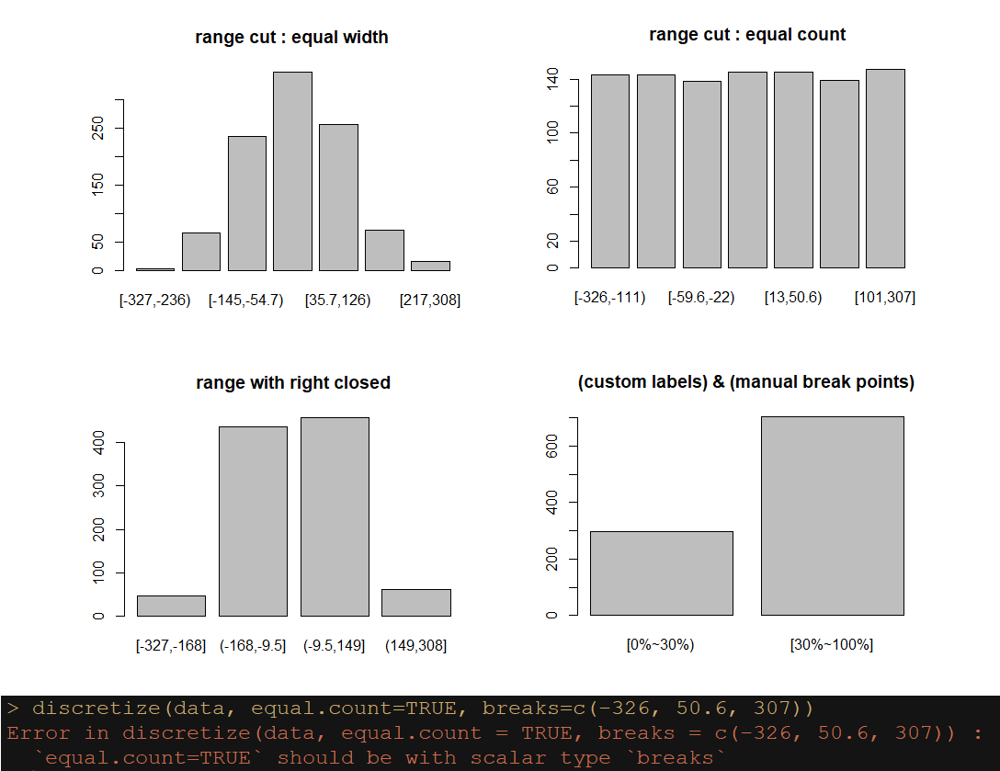

Q) 
주어진 numeric type vector를 적절한 구간으로 나누어 factor type으로  
이산화하는 함수 `discretize` 를 만들어주세요 :)  

> parameter 설명  
> 1. breaks : 분할 구간 수 (= scalar), 사용자 지정 분할 포인트 (= vector)  
> 2. equal.count : 동일 관측치 개수 분할 (= TRUE), 동일 간격 분할 (= FALSE)  
> 3. labels : 사용자 지정 구간 라벨  
> 4. right : 구간 우측(= 큰값) 닫힘 (= TRUE), 구간 우측 열림 (= FALSE)  

```{r, message=FALSE, warning=FALSE, include=FALSE}
rm(list=ls())
set.seed(20180330)

data <- floor(100*rnorm(1000))

discretize <- function(num.vec, breaks=4, equal.count=FALSE, labels=NULL, right=FALSE){

}

library(magrittr)

# examples : parameter options
discretize(data, breaks=7, equal.count=FALSE) %>% plot(main='range cut : equal width')
discretize(data, breaks=7, equal.count=TRUE) %>% plot(main='range cut : equal count')
discretize(data, equal.count=FALSE, right=TRUE) %>% plot(main='range with right closed')
data %>%
  discretize(
    num.vec=.,
    breaks=c(quantile(., probs=c(0, .3, 1))), 
    labels=c('[0%~30%)', '[30%~100%]')) %>% 
  plot(main='(custom labels) & (manual break points)')

# error cases : `equal.count` with `manual breaks`?
discretize(data, equal.count=TRUE, breaks=c(-326, 50.6, 307))
```


