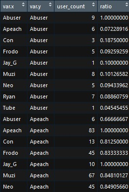
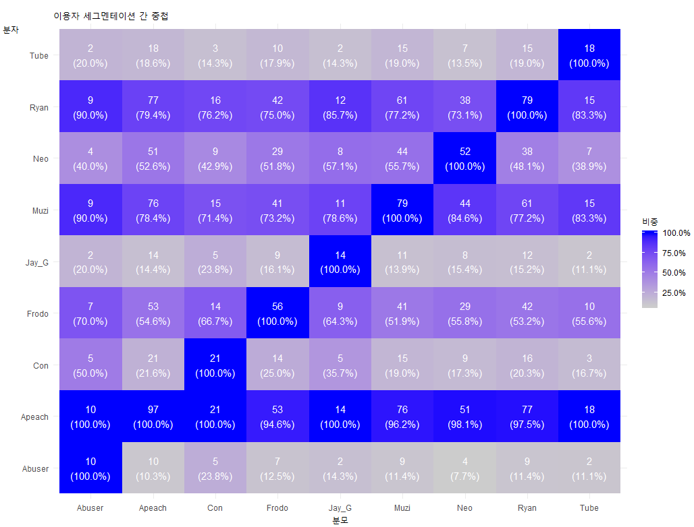

Q)  
다음과 같은 이용자 세그멘테이션 테이블을 `input`으로 받아  
시각화를 위한 기반 테이블 `output`을 제공하는  
함수 `segments.view` 를 작성해주세요!  

`input`  

  

`output`  

  

`ggplot view`  

  

```{r}
library(dplyr)
library(tidyr)
library(ggplot2)
library(scales)

rm(list=ls())

set.seed(20191210)

n <- 10^2

input <- 
  data.frame(
    id=1:n,
    Abuser=sample(x=c(0, 1), size=n, replace=TRUE, prob=c(.9, .1)),
    Jay_G=sample(x=c(0, 1), size=n, replace=TRUE, prob=c(.9, .1)),
    Tube=sample(x=c(0, 1), size=n, replace=TRUE, prob=c(.8, .2)),
    Frodo=sample(x=c(0, 1), size=n, replace=TRUE, prob=c(.4, .6)),
    Neo=sample(x=c(0, 1), size=n, replace=TRUE, prob=c(.4, .6)),
    Apeach=sample(x=c(0, 1), size=n, replace=TRUE, prob=c(.1, .9)),
    Muzi=sample(x=c(0, 1), size=n, replace=TRUE, prob=c(.2, .8)),
    Con=sample(x=c(0, 1), size=n, replace=TRUE, prob=c(.8, .2)),
    Ryan=sample(x=c(0, 1), size=n, replace=TRUE, prob=c(.2, .8))
  )
  
segments.view <- function(df){
  
}

output <- segments.view(input) 

output %>%
  ggplot(aes(x=var.x, y=var.y, fill=ratio)) +
  geom_tile() +
  geom_text(aes(label=paste(comma(user_count), '\n(', percent(ratio), ')', sep='')), size=4, colour='white') +
  scale_fill_gradient(high='blue', low='gray80', label=percent) +
  labs(title='이용자 세그멘테이션 간 중첩', x='분모', y='분자', fill='비중') +
  theme_minimal() +
  theme(axis.title.y = element_text(angle=0))
```

