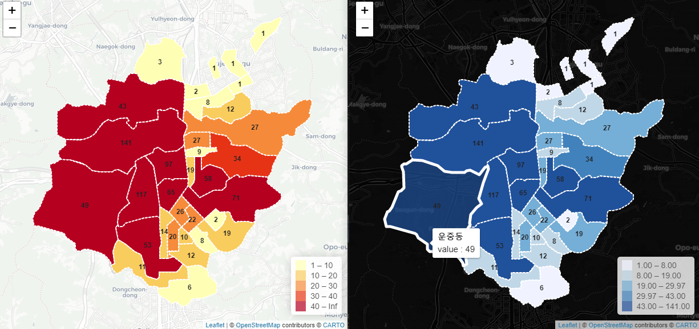

Q) 임의의 sf polygon object 를 넘기면 chart를 그려주는 함수 pretty.view 를 작성해주세요!
  
> 조건 :
  
- 입력 데이터는 sf polygon object 로서 id, name, value, geometry 컬럼으로 이루어져있습니다
  - id 컬럼은 식별자로서 unique 합니다
  - name 컬럼은 이름으로서 character 입니다
  - value 컬럼은 값으로서 numeric 입니다
  - geometry 컬럼은 sfc_MULTIPOLYGON 입니다

- pretty.view 함수의 arguments 는 data, map.provider, legend.cut, palette.name 총 4가지 입니다
  - data 는 입력 데이터입니다 (필수)
  - map.provider 는 leaflet의 providers 입니다 (선택)
  - legend.cut 은 입력 데이터의 value 컬럼을 discrete 하게 만들기 위한 구간 정보입니다 (선택)
  - palette.name 은 RColorBrewer 이름입니다 (선택)

> 행정동 정보(= polygons) 출처 : https://github.com/vuski/admdongkor

---
  
 

---
  
```{r}
# references : https://rstudio.github.io/leaflet/choropleths.html

library(dplyr)
library(stringr)
library(sf)
library(leaflet)
library(htmltools)

rm(list=ls())

points <- readRDS('points.RDS')
polygons <- readRDS('polygons.RDS')

poly.sum <-
  polygons %>%
  st_intersection(points$geometry) %>% 
  group_by(adm_cd, adm_nm) %>%
  summarise(counts = n()) %>%
  arrange(desc(counts)) %>%
  ungroup %>%
  as.data.frame %>%
  mutate(adm_nm_last = str_split(adm_nm, ' ') %>% lapply(function(x) x[3])) %>%
  select(adm_cd, adm_nm_last, counts)

view.data <-
  polygons %>%
  select(adm_cd) %>%
  inner_join(poly.sum, by='adm_cd') %>%
  transmute(id = adm_cd, name = adm_nm_last, value = counts)

pretty.view <- function(data, 
                        legend.cut=Inf, 
                        map.provider=providers$CartoDB.DarkMatter, 
                        palette.name='Blues'){
}

pretty.view(
  data=view.data, 
  legend.cut=c(1,10,20,30,40,Inf), 
  map.provider=providers$CartoDB.Positron,
  palette.name='YlOrRd'
)

pretty.view(view.data)
```
