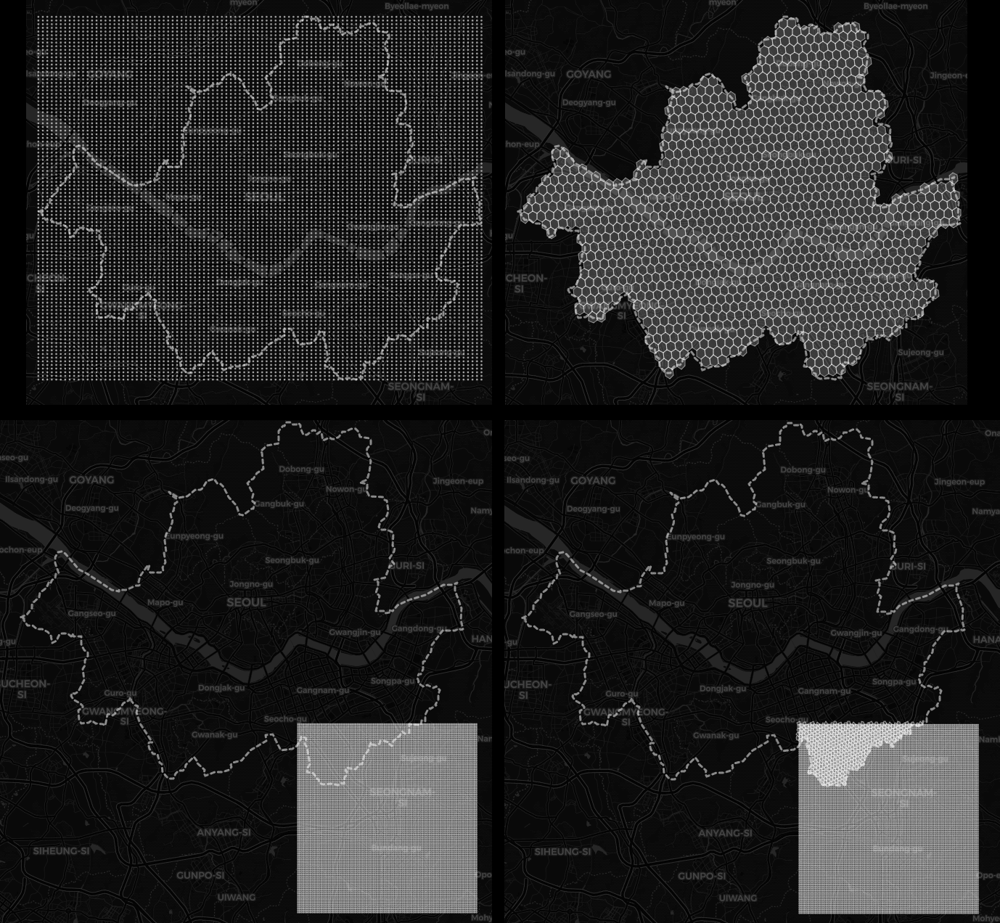

Q) 
입력값으로 points 와 polygon 을 받은 후  
서로 겹치는 부분을 Uber H3 hexagons 로 채워주는 함수 fill_h3 를 만들어주세요!  
  
h3.res 를 통해 h3 hexagon 해상도를 조절할 수 있어야 합니다~  
  
fill.h3 <- function(points, polygon, h3.res){ ... }  

---
  
 

---
  
```{r}
library(dplyr)
library(sf)
library(leaflet)

# devtools::install_github("obrl-soil/h3jsr")
library(h3jsr)

rm(list=ls())

seoul <- readRDS('seoul.RDS')
sungnam <- readRDS('sungnam.RDS')

# fill polygon's bbox with points
bbox.points <- function(polygon, density){
  bbox <- st_bbox(polygon)
  lat.seq <- seq(bbox[2], bbox[4], length.out=density)
  lng.seq <- seq(bbox[1], bbox[3], length.out=density)
  
  expand.grid(lng=lng.seq, lat=lat.seq) %>%
    rowwise %>%
    do(p=st_point(c(.$lng, .$lat))) %>%
    st_as_sf(crs=4326)
}

# fill the polygon with h3 hexagons which are made from input points
fill.h3 <- function(points, polygon, h3.res){

}

# ==============================

sungnam.bbox.points <- 
  bbox.points(sungnam, 100)

# background points : 'sungnam' bbox
# polygon to fill : seoul 

leaflet() %>%
  addProviderTiles(providers$CartoDB.DarkMatter) %>%
  addCircles(data=sungnam.bbox.points, weight=.7, color='white', fillOpacity=.5) %>%
  addPolygons(data=seoul, weight=3, dashArray=5, color='white', fillOpacity=0)

seoul.h3 <- 
  fill.h3(points=sungnam.bbox.points, polygon=seoul, h3.res=9)

leaflet() %>%
  addProviderTiles(providers$CartoDB.DarkMatter) %>%
  addCircles(data=sungnam.bbox.points, weight=.7, color='white', fillOpacity=.5) %>%
  addPolygons(data=seoul, weight=3, dashArray=5, color='white', fillOpacity=0) %>%
  addPolygons(data=seoul.h3, weight=1, color='white')

# ==============================

seoul.bbox.points <- 
  bbox.points(seoul, 100)

# background points : 'seoul' bbox
# polygon to fill : seoul 

leaflet() %>%
  addProviderTiles(providers$CartoDB.DarkMatter) %>%
  addCircles(data=seoul.bbox.points, weight=.7, color='white', fillOpacity=.5) %>%
  addPolygons(data=seoul, weight=3, dashArray=5, color='white', fillOpacity=0) 

seoul.h3.full <- 
  fill.h3(points=seoul.bbox.points, polygon=seoul, h3.res=8)

leaflet() %>%
  addProviderTiles(providers$CartoDB.DarkMatter) %>%
  addPolygons(data=seoul, weight=3, dashArray=5, color='white', fillOpacity=0) %>%
  addPolygons(data=seoul.h3.full, weight=1, color='white')
```
