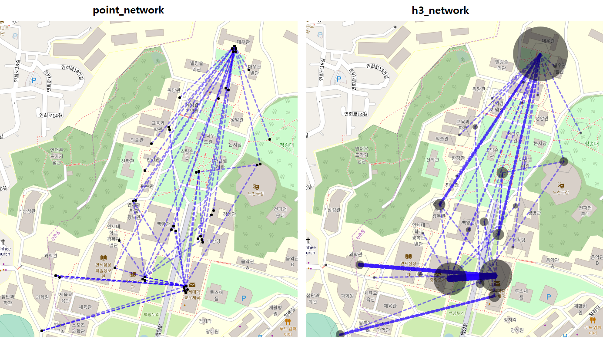

Q) 지리정보를 기반으로 네트워크를 그려주는 함수 point.network 와 h3.network 를 작성해주세요!  
  
> 조건 :
  
- point.network는 event point를 그대로 node 삼아 network를 그립니다  
- h3.network는 event point들을 h3 hexagon으로 변환 후 그 중심점을 node로 삼아 network를 그립니다  
- h3.network는 집계된 event count (= idx 기반) 를 기준으로 node의 크기 및 edge의 굵기를 지정합니다  
- h3.network에서 edge의 event count 집계는 (node A -> node B) == (node B -> node A) 임을 주의하세요!   
- h3.network의 h3.res는 h3 resolution을 조절합니다  

---
  
 

---

```{r}
library(dplyr)
library(sf)
library(leaflet)

# devtools::install_github("obrl-soil/h3jsr")
library(h3jsr)

rm(list=ls())

data <- readRDS('points.RDS')

# ======================

# 1. draw nodes & edges
point.network <- function(df){

}

point.network(data)

# 2. draw h3 center points as nodes & edges
h3.network <- function(df, h3.res=11){

}

network <- h3.network(data)

node <- network$node
edge <- network$edge
h3.border <- network$h3.border

node.weight <- 3
edge.weight <- 3 
node.filter <- 1 
edge.filter <- 1

leaflet() %>%
  addTiles %>%
  addPolygons(data=h3.border, color='gray', fillOpacity=0, opacity=.5, weight=1.5) %>%
  addPolylines(data=edge %>% filter(edge_count >= edge.filter), color='blue', dashArray=6, weight=~edge_count*node.weight) %>%
  addCircles(data=node %>% filter(node_count >= node.filter), fillColor='black', fillOpacity=.5, opacity=0, radius=~node_count*node.weight)

```
