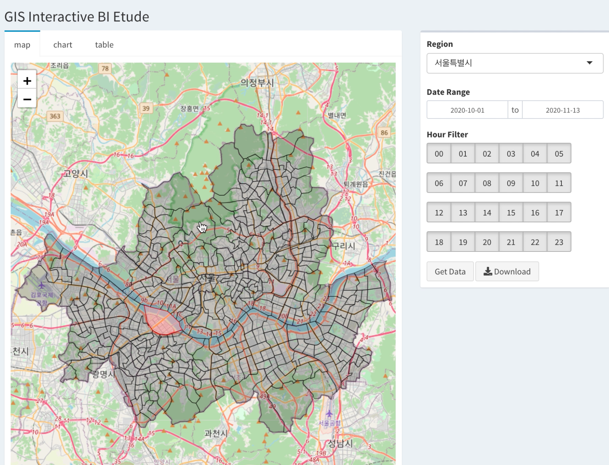

Q) 실전에서 사용가능한 GIS 기반 BI 툴 한번 만들어봅시다!  

> 조건 :
  
- Region(서비스 지역), Date Range(가져올 데이터 일자 구간), Hour Filter(가져올 데이터의 시간대) 를 입력 받습니다  
- Get Data 버튼을 눌러 데이터를 가져옵니다 (실전이라면 DB에 쿼리를 날리는 거겠죠?)  
- 화면 왼쪽 map 탭에 뜬 세부지역 폴리곤들을 클릭으로 on/off 하여 chart, table 탭의 내용을 변경합니다  
- map 탭의 클릭의 선택 on/off 는 chart, table 탭 내용에 즉시 반영됩니다. 선택된 map polygon은 적색으로 표시됩니다  
- 다시 Get Data 를 눌러 새로운 조건으로 데이터를 가져오면 map, chart, table이 초기화 됩니다. click 정보는 날아갑니다  
- download 버튼을 누르면 table 탭의 내용을 csv 파일로 다운로드 받습니다  

> 행정동 경계 출처 : https://github.com/vuski/admdongkor

---
  
 
> 어플리케이션 영상 : `bi_etude_result.mp4` 참조

---
  
```{r}
library(dplyr)
library(sf)

library(shiny)
library(shinydashboard)
library(shinyWidgets)
library(stringr)

library(leaflet)
library(ggplot2)
library(scales)
library(DT)

library(curl)
library(showtext)

rm(list=ls())

# pre setting ==================

set.seed(20201115)

geo.data <- 
  readRDS('korea.RDS') %>%
  mutate(name = factor(x=name))

regions <- 
  geo.data %>% 
  as.data.frame %>%
  distinct(region.code, region) %>%
  arrange(region.code)

region.menu <- regions$region.code
names(region.menu) <- regions$region

date.formatter <- function(d) format(d, '%Y-%m-%d')
start.date <- date.formatter(Sys.Date() - 31) 
end.date <- date.formatter(Sys.Date() - 1) 

hour.formatter <- function(h) as.character(h) %>% str_pad(width=2, pad='0')
hour.1q <- hour.formatter(0:5)
hour.2q <- hour.formatter(6:11)
hour.3q <- hour.formatter(12:17)
hour.4q <- hour.formatter(18:23)

value.data.size <- nrow(geo.data) * 20

value.data <-
  data.frame(
    code = geo.data$code,
    date = date.formatter(Sys.Date() + sample(0:-50, size=value.data.size, replace=TRUE)),
    hour = hour.formatter(sample(0:23, size=value.data.size, replace=TRUE)),
    value = floor(runif(value.data.size)*100),
    stringsAsFactors = FALSE
  )
```
